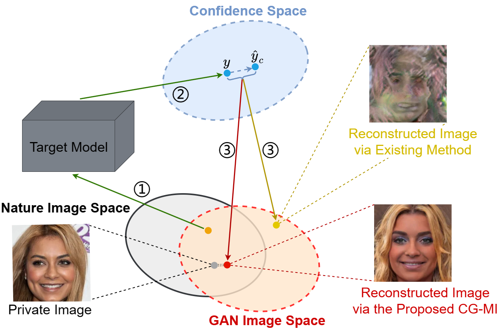
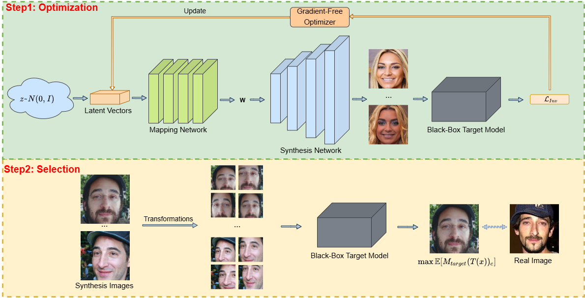

# Enhancing Model Inversion Attacks Against Deep Neural Networks in Black-Box Settings

<div style="display: flex; flex-direction: row; align-items: center;">

  <div style="flex: 1; margin-right: 20px;">
    <p><strong>Abstract:</strong> Model inversion attacks (MIAs) seek to infer the private training data of a target classifier by generating synthetic images that reflect the characteristics of the target class through querying the model. However, prior studies have relied on full access to the target model, which is not practical in real-world scenarios. Additionally, existing black-box MIAs assume that the image prior and target model follow the same distribution. However, when confronted with diverse data distribution settings, these methods may result in suboptimal performance in conducting attacks. To address these limitations, this paper proposes a <strong>C</strong>onfidence-<strong>G</strong>uided <strong>M</strong>odel <strong>I</strong>nversion attack method called CG-MI, which utilizes the latent space of a pre-trained publicly available generative adversarial network (GAN) as prior information and gradient-free optimizer, enabling high-resolution MIAs across different data distributions in a black-box setting. Our experiments demonstrate that our method significantly <strong>outperforms the SOTA black-box MIA by more than 49% for Celeba and 58% for Facescrub in different distribution settings</strong>. Furthermore, our method exhibits the ability to generate high-quality images <strong>comparable to those produced by white-box attacks</strong>. Our method provides a practical and effective solution for black-box model inversion attacks.</p>
  </div>

  <div style="flex: 1; text-align: center;">
    
    <p style="margin-top: 10px; font-weight: bold;">Illustration of private training data leakage for a specific target class c via the target model output confidence.
</p>
  </div>

</div>


## Model Inversion Attacks
  <center>
  
  </center>

Privacy protection and attacks have been extensively studied, attracting significant attention within the scientific community. Model inversion attacks (MIAs) represent a class of attacks aimed at compromising the privacy protection of models. MIAs target the retrieval of sensitive information about the model’s training data by leveraging known model outputs, thus putting user privacy at risk. For instance, an attacker may query the output of a facial recognition model and, upon successful exploitation, generate synthetic images that reflect the user’s facial features, thereby violating user privacy.


# Setup and Run Attacks

## Download Pretrained Image Prior Weight
To download the pre-trained weights for [FFHQ256](https://nvlabs-fi-cdn.nvidia.com/stylegan2-ada-pytorch/pretrained/transfer-learning-source-nets/ffhq-res256-mirror-paper256-noaug.pkl), [Metfaces](https://nvlabs-fi-cdn.nvidia.com/stylegan2-ada-pytorch/pretrained/) and [AFHQ.dogs](https://nvlabs-fi-cdn.nvidia.com/stylegan2-ada-pytorch/pretrained/afhqdog.pkl), and place all pre-trained weights in the folder  ```./Stylegan2_weight/```.


## Prepare Datasets
We support [FaceScrub](http://vintage.winklerbros.net/facescrub.html), [CelebA](https://mmlab.ie.cuhk.edu.hk/projects/CelebA.html) and [Stanford Dogs](http://vision.stanford.edu/aditya86/ImageNetDogs/) as datasets to train the target models. Place all datasets in the folder ```data``` and make sure that the following structure is kept:

    .
    ├── data       
        ├── celeba
            ├── img_align_celeba
            ├── identity_CelebA.txt
            ├── list_attr_celeba.txt
            ├── list_bbox_celeba.txt
            ├── list_eval_partition.txt
            ├── list_landmarks_align_celeba.txt
            └── list_landmarks_celeba.txt
        ├── facescrub
            ├── actors
                ├── faces
                └── images
            └── actresses
                ├── faces
                └── images
        ├── stanford_dogs
            ├── Annotation
            ├── Images
            ├── file_list.mat
            ├── test_data.mat
            ├── test_list.mat
            ├── train_data.mat
            └── train_list.mat

For CelebA, we used a custom crop of the images using the [HD CelebA Cropper](https://github.com/LynnHo/HD-CelebA-Cropper) to increase the resolution of the cropped and aligned samples. We cropped the images using a face factor of 0.65 and resized them to size 224x224 with bicubic interpolation. The other parameters were left at default. Note that we only use the 1,000 identities with the most number of samples out of 10,177 available identities. 
            
## Train Target Models
```bash
python train_target.py -c=configs/training/default_training.yaml
```
Modify ```configs/training/default_training.yaml``` to change the architectures of the models (ResNet, ResNeSt, DenseNet, and Inception-v3). Place all model weights in the folder ```./results/```.

## Perform Attacks
```bash
python CG_attack.py -c=configs/attacking/ffhq_celeba.yaml
```
Select a specified attack configuration file to conduct attacks on different data distributions.


## Acknowledgements
We gratefully acknowledge the following works:
- PPA: https://github.com/LukasStruppek/Plug-and-Play-Attacks
- CMA-ES: https://github.com/CMA-ES/pycma
- Stylegan2-ada: https://github.com/NVlabs/stylegan2-ada-pytorch
- BO: https://github.com/uber-research/TuRBO

## Reference
Struppek, Lukas, et al. "Plug & Play Attacks: Towards Robust and Flexible Model Inversion Attacks", ICML(2022).
